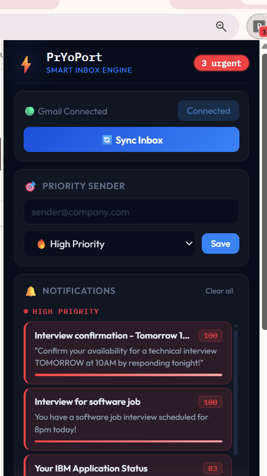
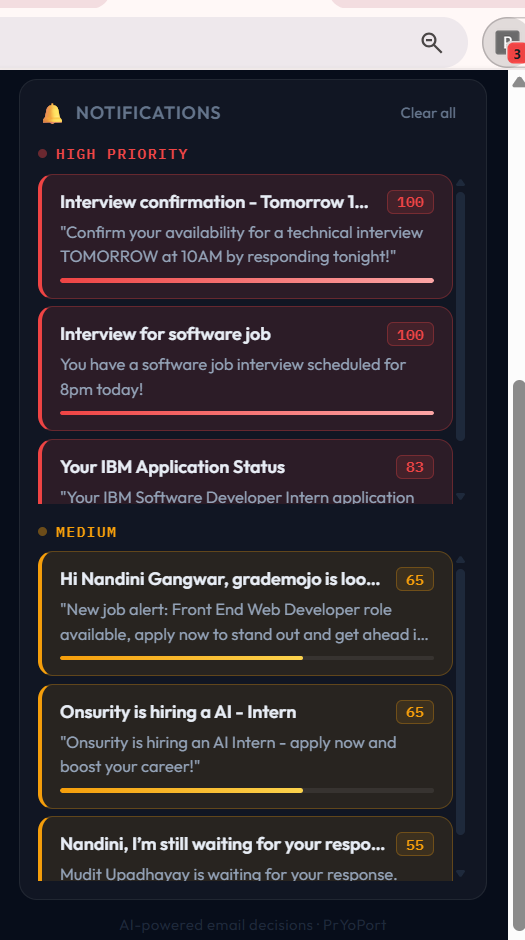
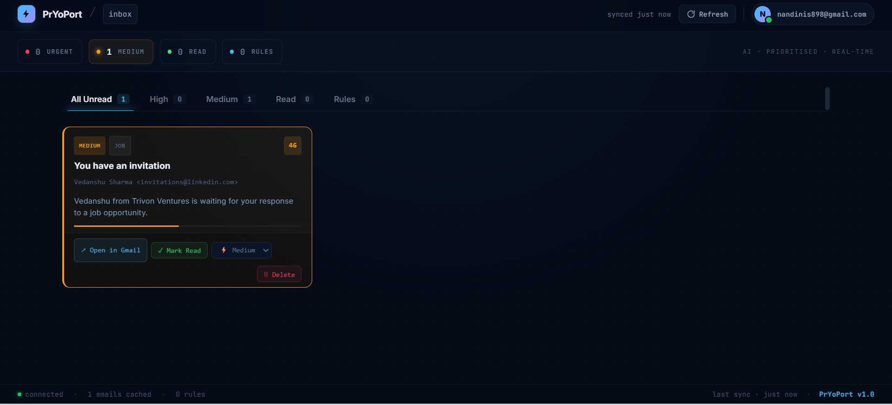

# 🚀 PRYOPORT
<p align="center">
It is an AI-powered Chrome extension that intelligently filters, classifies, prioritizes, and summarizes emails using a hybrid ML + LLM orchestration pipeline.
It combines **Machine Learning agents + Gmail API integration + Google OAuth authentication + full-stack dashboard** to help users focus only on what matters.
Built to solve inbox overload for students, professionals, and job seekers by surfacing only the emails that truly matter
</p>

---

# 📸 Project Preview
<table>
<tr>
<td align="center">

<br/>
<b>Chrome Extension Popup</b>
</td>

<td align="center">

<br/>
<b>Smart Notifications</b>
</td>
</tr>

<tr>
<td colspan="2" align="center">

<br/>
<b>Real-Time React Dashboard</b>
</td>
</tr>
</table>
---

# 🧠 Key Features

✅ AI-powered email classification  
✅ ML-based urgency prediction  
✅ Smart notification summaries  
✅ Gmail integration + Google OAuth Login  
✅ Chrome extension popup dashboard  
✅ Badge count for important emails  
✅ Sender reputation learning  
✅ User interaction learning  
✅ Manual sender priority rules  
✅ Real-time inbox synchronization  
✅ Hybrid ML + LLM orchestration pipeline  

---
# Flow Overview

1. Emails are fetched from Gmail using Gmail API
2. `email_crew.py` acts as the central orchestrator
3. Semantic filtering removes low-value promotional noise
4. Classification Agent determines email intent/category
5. Urgency ML model predicts urgency score
6. Sender reputation + manual priority rules influence final score
7. Final priority is calculated
8. Processed emails are stored in SQLite `emails` table
9. If priority is HIGH:
   - Summary Agent generates notification summary
   - notification entry is created
10. Chrome extension fetches notifications and updates badge count

---

# 🤖 Multi-Agent System
### 🧩 Classification Agent
Categorizes emails semantically into:
- interview
- internship
- job
- spam
- promotion
- general
- tasks
- meetings

---
### ✨ Summarization Agent
Generates concise AI-powered summaries for notifications and dashboard display.

---
### 📊 ML Urgency Prediction Model
Uses:
- TF-IDF Vectorization
- Logistic Regression
- sender signals
- behavioral learning
- category understanding

to predict urgency scores intelligently.

---
# 📩 Gmail Integration

- Fetch emails using Gmail API
- Real-time email analysis
- OAuth token lifecycle management
- Secure authentication flow
- Sync inbox directly inside extension

---

# 🔐 Authentication

- Google OAuth 2.0 Login
- Secure token handling
- User session management
- Gmail permission authorization

---
# Scalability & Cost Optimization 
PryoPort was intentionally designed as a cost-optimized MVP to operate efficiently on free-tier infrastructure and APIs. 
To reduce: - unnecessary API calls 
- LLM inference costs
- Gmail polling overhead
- backend compute usage the current version uses a **manual sync mechanism** instead of continuous background polling.
-  Users can manually trigger inbox synchronization from the Chrome extension to fetch and analyze new emails. 

---

# ⚡ AI Orchestration Pipeline

```text
Gmail Inbox
    ↓
Email Fetch Service
    ↓
email_crew.py (Main Orchestrator)
    ├── Semantic Email Filter
    ├── Classification Agent
    ├── Urgency ML Model
    ├── Manual Priority Rules
    ├── Sender Reputation Signals
    └── Priority Decision Engine
            ↓
      Emails Table (SQLite)
            ↓
    High Priority Check
            ↓
      Summary Agent
            ↓
    Notifications Table
            ↓
Chrome Extension Notifications


## 🗄️ Database Architecture

### Emails Table
Stores:
- subject
- sender
- snippet
- category
- urgency score
- priority
- AI summary

---

### Rules Table
Stores:
- manual sender priority rules
- user-defined overrides

Example:
- always prioritize emails from specific senders

---

### Notifications Table
Stores:
- high-priority notifications only
- notification summaries
- urgency score
- badge state

This separation keeps notification fetching lightweight and optimized.


